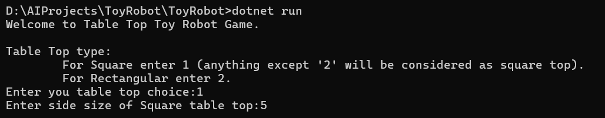
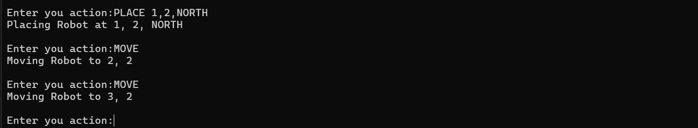

# ToyRobot
This is a simple simulation of a toy robot moving on a square tabletop. This project is developed using .net version 8.

# Description
Below two points are were part of challenge but I made it flexible for user to choose the table top:

- The application allows the toy robot to roam around the surface of the table according to given commands. User can opt between Square or Rectangular table top.
- User have flexibility to declare the size of the table top.

Other considerations:

- There are no other obstructions on the table surface.
- The robot is free to roam around the surface of the table, but must be prevented from falling to destruction. Any movement that would result in the robot falling from the table must be prevented, however further valid movement commands must still be allowed.
- Application can read in commands of the following form -
  - PLACE X,Y,F --- here X is position on x axis (to wards north) and Y is position on Y axis towards East, F is direction of robot currently facing
  - MOVE
  - LEFT
  - RIGHT
  - REPORT
- PLACE will put the toy robot on the table in position X,Y and facing NORTH, SOUTH, EAST or WEST.
- The origin (0,0) can be considered to be the SOUTH WEST most corner.
- The first valid command to the robot is a PLACE command, after that, any sequence of commands may be issued, in any order, including another PLACE command. The application should discard all commands in the sequence until a valid PLACE command   has been executed.
- MOVE will move the toy robot one unit forward in the direction it is currently facing.
- LEFT and RIGHT will rotate the robot 90 degrees in the specified direction without changing the position of the robot.
- REPORT will announce the X,Y and F of the robot. This can be in any form, but standard output is sufficient.
- A robot that is not on the table can choose the ignore the MOVE, LEFT, RIGHT and REPORT commands.

## Constraints

The toy robot must not fall off the table during movement. This also includes the initial placement of the toy robot.
Any move that would cause the robot to fall must be ignored.

# Usage
To use the application, follow these steps:

1. Clone the repository:

    `git clone https://github.com/your-username/toy-robot.git`

2. Open command prompt at `ToyRobot/ToyRobot` folder (where `ToyRobot.csproj` is present)

3. To build and run the application.

    `dotnet build`
    `dotnet run`

4. To get table in question i.e. 5x5 see below

5. To do actions enter approriate action:

# Assumptions

1. Table looks like as below

            W
      |----------------------|
      |                      |
    S |                      | N
      |                      |
      |----------------------|
            E

      W
  S       N
      E

2. S to N is 'X' axis and W to E is 'Y' axis.

3. `S,W` most cell is `0,0` and `N,E` most cell for 5x5 table top is `4,4`
